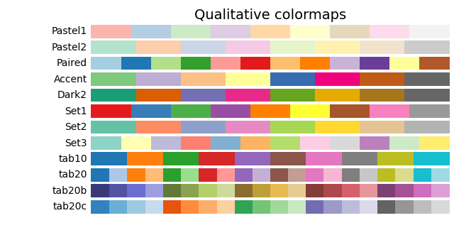

<div align=center STYLE="page-break-after: always;">

<br/><br/><br/><br/><br/><br/><br/><br/><br/><br/>
    <font size=12 face="黑体">
        搭建属于你的地震数据处理Ubuntu平台
    </font>
     <font size=6 face="楷体">
        一些常见的问题解决方案以及实用提示
    </font>   
    <br/><br/><br/><br/><br/><br/>
        <font size = 4>
        学校：成都理工大学
        学院：地球物理学院
        作者：李子霏<br/>
        <br/><br/>
        2021.06.20-
    </font>
</div>

<div STYLE="page-break-after: always;">

[TOC]

</div>

<div STYLE="page-break-after: always;">

# 说明
该文档为在使用ubuntu系统作为地震数据处理平台过程中遇到的一些问题和常用软件安装，根据该文档可以搭建ubuntu系统安装常用的地震数据处理编程软件Madagascar和seismic unix，以及使用ubuntu终端直接进行python、matlab、c/cpp/cu语言的书写和运行。对于想要使用ubuntu作为主系统进行工作的同志，强烈建议对zshell，neovim进行配置，否则在使用过程中会耽误很多时间。

</div>

# 安装ubuntu
- 主分区

主分区是Linux硬盘中最基本的分区类型。在硬盘上，您可以创建最多4个主分区。每个主分区都可以安装一个操作系统。如果您想安装多个操作系统，则需要一个主分区来保存每个操作系统。

另外，一个主分区可以变成扩展分区或逻辑分区，但是这将减少可用的主分区数目。扩展分区是一个特殊的主分区，它可以划分多个逻辑分区。扩展分区本身不能保存文件或数据，只能用来创建逻辑分区。
- 逻辑分区

逻辑分区是一种不同于主分区的分区类型，它不存在于硬盘上的分区表中。逻辑分区只能建在一个扩展分区上，而扩展分区则必须是硬盘上4个主分区之一。逻辑分区不需要格式化为文件系统，只需要被分配了一个文件系统类型的ID。逻辑分区可存储文件和数据，就像主分区一样。

- 分区大小设置：

| 分区名称  |   分区格式     | 分区类型        | 大小  |说明 |
| ------- | ------------- | -------------- |--------|--|
| /swap   | 逻辑分区       | /swap或交换分区  |电脑内存|虚拟内存，当内存小于16G时可以设成内存两倍，大于16G时和内存一样大就行|
| /home   | 主分区         | ext4           |D盘    |存放数据以及安装软件可以在这，这个分区可以最后设置然后剩余的所有内存都给home|
| /       | 逻辑分区       | ext4           |C盘     |系统盘，对于新手强烈建议这个分区给大一点，因为软件默认都是安装在这，但是ubuntu指定安装路径并不像windows那么简单，很多新手不知道如何指定安装路径到home路径下。|
| /boot   | 逻辑分区       | ext4           |0.5-2G|存放一些日志文件和启动引导项，根据你的ubuntu系统盘大小视情况而定|

# Zshell^！^
## 安装zshell
`sudo apt-get install zsh`
## oh-my-zsh配置
`git clone git://github.com/robbyrussell/oh-my-zsh.git /home/lzf/softwares/oh-my-zsh`
`cp /home/lzf/softwares/oh-my-zsh/templates/zshrc.zsh-template ~/.zshrc`
然后记得在.zshrc文件中将oh-my-zsh文件夹路径定位。默认路径是~/.oh-my-zsh
# neovim^!^
## install
`sudo apt-get install neovim`
## 主题插件配置
### 快速安装

这是 [向军大叔](https://gitee.com/houdunwang/nvim) 使用的 neovim 配置，本章可以帮助你快速配置好用的 nvovim 环境


### 安装软件

#### 环境依赖

下面是依赖的软件环境，请确定系统中已经安装成功

- [npm](https://nodejs.org/zh-cn/)
- [yarn](https://classic.yarnpkg.com/en/docs/install/#mac-stable)
- [python](https://www.python.org/downloads/)
- [neovim](https://github.com/neovim/neovim/wiki/Installing-Neovim)
- [vim-plug](https://github.com/junegunn/vim-plug)
- [ranger](https://ranger.github.io/)

首先安装环境需要的软件

```
# mac
brew install node python3 yarn ranger python-pip

# manjaro
sudo pacman -Sy node python3 yarn ranger python-pip

# ubuntu
sudo apt install node python3 yarn ranger python-pip

# centos
sudo yum install node python3 yarn ranger python-pip
```

然后安装 neovim 需要软件包

```
python -m pip install pynvim

pip3 install --user --upgrade neovim

pip3 install ranger-fm
```

[vim-plug](https://github.com/junegunn/vim-plug)是一款非常轻量又高效的 vim 插件管理工具。它支持全异步、多线程并行安装插件，支持 git 分支、标签等，可以对插件进行回滚更新、还支持**按需加载**插件(On-demand loading)，可以指定对特定文件类型加载对应 vim 插件，大大加快了 vim 启动时间。

#### vim-plug

可通过官网查看安装细节 [https://github.com/junegunn/vim-plug](https://github.com/junegunn/vim-plug)，因为是国外服务器所以你要多试几次。为了帮助大家正常下载，下面的的链接地址已经放在后盾人 CDN 服务器上了。

```
curl -fLo ~/.local/share/nvim/site/autoload/plug.vim --create-dirs \
    https://houdunren-video.oss-cn-hangzhou.aliyuncs.com/soft/plug.vim
```

#### 执行安装

下面列出的常用系统的安装方法，其他系统参考[官方文档](https://github.com/neovim/neovim/wiki/Installing-Neovim)进行安装

```
# MAC
brew install neovim

# manjaro
sudo pacman -Sy neovim

# ubuntu
sudo apt install neovim

# CENTOS 8
yum install neovim
```

注销并重新登录后执行`nvim`就可以打开软件了

### 安装配置

配置还是比较简单的，下载包后执行脚本，再次打开 neovm 时将自动安装插件

#### 下载项目

clone 项目

```
git clone https://gitee.com/houdunwang/nvim.git ~/.config/nvim
```

#### 安装插件

打开 nvim 执行以下命令安装 coc 扩展

```
CocInstall coc-css coc-explorer coc-html coc-snippets coc-ember coc-json coc-emmet coc-tsserver coc-highlight coc-prettier coc-vetur coc-git coc-svg coc-phpls coc-eslint coc-tailwindcss coc-fzf-preview coc-tabnine

CocCommand eslint.showOutputChannel
```

### 安装后执行

安装 intelephense

```
npm i intelephense -g
```

进入 `~/.vim/plugged/bracey.vim` 执行以下命令，用于生成 liver-server 环境

```
cd ~/.vim/plugged/bracey.vim
npm install --prefix server
```

### 按键定义

Leader 键定义为了空格，下面是自定义的按键说明

#### 移动定位

| 热键    | 说明             | 模式 |
| ------- | ---------------- | ---- |
| mm      | 添加注释         |      |
| shift+k | 上移 5 行        |      |
| shift+j | 下移 5 行        |      |
| gd      | 转到类、函数定义 |      |
| gf      | 跳转到文件       |      |
| ctrl+j  | 行首             | 编辑 |
| ctrl+k  | 行尾             | 编辑 |

#### 文件操作

| 热键     | 说明                 |
| -------- | -------------------- |
| rc       | 打开当前目录         |
| rp       | 打开项目目录         |
| fp       | 项目文件检测         |
| fb       | 显示 Buffers 文件    |
| fg       | 显示文件 GIT 状态    |
| C-j      | 保存                 |
| C-k      | 最近打开的文件       |
| leader+f | fzf 项目文件模糊搜索 |
| leader+b | fzf Buffer 文件搜索  |

#### 浮动窗口

| 热键   | 说明                  |
| ------ | --------------------- |
| tl     | 打开浮动窗口          |
| tr     | 打开 Ranger 浮动窗口  |
| td     | 连接 homestead 数据库 |
| ctrl+h | 隐藏浮动窗口          |
| ctrl+n | 切换上个浮动窗口      |

#### 其他操作

| 热键    | 说明                                          |
| ------- | --------------------------------------------- |
| :Bracey | 浏览器同步插件，类似 vscode 中的 liver-server |

### 插件列表

下面是使用的部分插件，你也可以查看官方文档来自行配置插件

1. [https://github.com/neoclide/coc.nvim](https://github.com/neoclide/coc.nvim)
2. [https://github.com/mhinz/vim-startify](https://github.com/mhinz/vim-startify)
3. [https://github.com/Yggdroot/LeaderF](https://github.com/Yggdroot/LeaderF)
4. [https://github.com/ap/vim-css-color](https://github.com/ap/vim-css-color)
5. [https://github.com/vim-airline/vim-airline](https://github.com/vim-airline/vim-airline)
6. https://github.com/vim-airline/vim-airline-themes
7. [https://github.com/gcmt/wildfire.vim](https://github.com/gcmt/wildfire.vim)
8. [https://github.com/tpope/vim-surround](https://github.com/tpope/vim-surround)
9. [https://github.com/justinmk/vim-sneak](https://github.com/justinmk/vim-sneak)

# Madagascar
为什么要叫mada（


Madagascar是一个用于多维数据分析和可重复计算实验的开源软件包。它的使命是提供方便而强大的环境、简单的地震数据常用处理函数、和便捷的代码专业工具。适用于在地球物理学和相关领域从事数字图像和数据处理的研究人员。使用mada项目管理系统开发的技术以历史记录的形式传输，这些历史成为“计算配方”，由系统用户进行验证、交换和修改。

## 安装mada
1. 下载mada安装文件:
  `git clone https://github.com/ahay/src RSFSRC`或者`svn co https://github.com/ahay/src/trunk RSFSRC`
- 预安装：
  不同系统需要安装不同的依赖软件
  为了方便查错所以这里分开写供安装使用吧
  -  `sudo apt-get install libxaw7-dev freeglut3-dev libnetpbm10-dev libgd-dev` 
  -  `sudo apt-get install libplplot-dev libavcodec-dev libcairo2-dev libjpeg-dev`
  -  `sudo apt-get install swig python-dev python-numpy g++ gfortran` 
  -  `sudo apt-get install libopenmpi-dev libfftw3-dev libsuitesparse-dev scons git`
2. 配置安装路径
  - 配置matlab环境变量,制作mex链接
    `sudo ln -s /home/lzf/softwares/Mat-lab/bin/mex /usr/local/bin/mex`
  - 配置Madagascar安装环境和api接口
    `./configure --prefix= /directory/where/you/want/madagascar/installed/RSFROOT`
    您可以通过运行 scons -h 来获取可自定义变量的完整列表。例如，要安装 matlab API 绑定以及基本软件包，请运行：
    `API=matlab`* 
    `CUDA TOOLKIT PATH= `*
    其中prefix 指定安装路径,API和CUDA设置根据CUDA路径以及matlab安装路径来决定
    	该步骤有时会报错如下，此时检查config.py文件，如果正常生成并且里面的设置正确，就可直接执行安装了。
```bash
scons: Reading SConscript files ...
scons: done reading SConscript files.
usage: scons [OPTION] [TARGET] ...

SCons Error: no such option: --prefix
------------------------
Done with configuration.
```
  3. 安装
    `scons install` 或者 `make install`
  4. 配置环境变量
    以下内容写入.rc环境文件中:
    - `export RSFROOT=/home/lzf/softwares/Madagascar/RSFROOT` 马达安装路径
    - `source $RSFROOT/share/madagascar/etc/env.sh` 加载马达环境变量
    - `export DATAPATH=/home/lzf/data/.Mada/data/ `马达二进制数据和rsf文件是分离开的，该命令设置马达二进制数据保存路径
    - `export RSFFIGS=/home/lzf/data/.Mada/Figure/ `马达生成文章是保存的路径
    - `export RSFALTFIGS=/home/lzf/data/.Mada/Figure1/ `马达test例子存放位置
    - `export RSFMEMSIZE=30000`允许最大的内存(Mb)
      代码块如下：
```bash
export RSFROOT=/home/lzf/softwares/Madagascar/RSFROOT
source $RSFROOT/share/madagascar/etc/env.sh
export DATAPATH=/home/lzf/data/.Mada/data/ 
export RSFFIGS=/home/lzf/data/.Mada/Figure/ 
export RSFALTFIGS=/home/lzf/data/.Mada/Figure1/ 
export RSFMEMSIZE=30000
```
5. 安装成功测试
终端输入`sfin`:

下面是一个简单的 SConstruct 文件：
```python
#
# Setting up
#
from rsf.proj import *

#
# Make filter.rsf
#
Flow('filter',None,'spike n1=1000 k1=300 | bandpass fhi=2 phase=y')

#
# Make filter.vpl
#
Result('filter','wiggle clip=0.02 title="Welcome to Madagascar"')
End()
```
## mada 保存图片：
`vpconvert *.vpl format=jpg color=y bgcolor=white`
## mada常用命令:
sfadd减法      :`add scale=1,-1 ${SOURCES[1]}`
sfwindow参数   : n#=* 指的在第#个道集采多* 长，f#=* 指的是采样间隔，

# Seismic Unix
SU是科罗拉多州矿业学院开发的一个免费地震处理软件。国内外很多科研人员及学生都借助于他来进行创作，SU开放源代码，可以方便地在其基础上进行再创作。其实有了mada就不用su了，一个爹生的。
## 安装su
1. 下载su安装文件:
[https://nextcloud.seismic-unix.org/s/LZpzc8jMzbWG9BZ](https://nextcloud.seismic-unix.org/s/LZpzc8jMzbWG9BZ)
- 解压
```bash
mkdir /where/you/want/su/put
cd /where/you/want/su/put
gunzip cwp_su_all_xx_tar.gz
tar -xvf cwp_su_all_xx_tar
```
- 预安装：
  不同系统需要安装不同的依赖软件
  为了方便查错所以这里同样分开写供安装使用
  - sudo apt-get install build-essential
  - sudo apt-get install libx11-dev
  - sudo apt-get install libxt-dev
  - sudo apt-get install freeglut3-dev
  - sudo apt-get install libxmu-dev
  - sudo apt-get install libxi-dev
  - sudo apt-get install gfortran
2. 配置环境
- .rc环境变量文件中写入
```bash
export CWPROOT=/where/you/su installpack/su
export PATH=$PATH:/where/you/su installpack/su/bin
```
强烈不推荐任何直接替换Makefile.config的博文方法，如需特定的Makefile.config格式请打开su中的configs文件夹结合自身电脑选择并替换，注意su部分版本会因为Linux内核版本而安装失败。
- 安装
``` bash
cd $CWPROOT/src
make install 
make xtinstall
make finstall # fortran模块
make mglinstall
make utils
make xminstall
make sfinstall  # segd模块
```
3. 安装成功测试
终端输入`suplane | suxwigb`

## 二进制数据绘图
`ximage <acc_vp_2.dat n1=400 prec=99 cmap=rgb2`

# C/C++/C-cuda/mpich
- 错误调试
在makefile文件中添加`CFALGS= -g -Wall`生成调试文件
具体做法：
`$(MPICC) -g -Wall -g -c`
`$(NVCC)  -g -w -c`
然后在 GDB 中运行程序并进行调试。例如，你可以使用 run 命令来运行程序，使用 break 命令设置断点，使用 print 命令打印变量的值，等等。详细的使用方法可以参考 GDB 的文档或者相关教程。
- mpicc
MPICC运行结果不正确大部分原因是进程问题，可以将`mpicc -np`参数改为1然后尝试运行
- makefile模版
  根据需要更改对应路径位置
```
# ==================================================================================
#    Copyright (C) 2024 Chengdu University of Technology.
#    Copyright (C) 2024 Zifei Li.
#    
#    Filename：Makefile
#    Author：Zifei Li
#    Institute：Chengdu University of Technology
#    Email：202005050218@stu.cdut.edu.cn
#    Work：2024/02/04/
#    Function：
#    
#    This program is free software: you can redistribute it and/or modify it 
#    under the terms of the GNU General Public License as published by the Free
#    Software Foundation, either version 3 of the License, or an later version.
#=================================================================================
#!/bin/bash
#include /home/lzf/softwares/makeopt/makefile.opt`
CXX = g++
CC = gcc
###################### fftw #############################
#FFTW_DIR = /home/lzf/softwares/FFTW
#FFTW_INC = -I$(FFTW_DIR)/include
#FFTW_LIB = -I$(FFTW_DIR)/lib
#################### Madagascar ########################
#${RSFROOT}= /home/lzf/softwares/madagascar
#RSFROOT_lib = -L${RSFROOT}/lib -lrsf -lrsf++ -lm
#################### cuda ########################
#CUDA_HOME = /usr/local/cuda-12.2
#NVCC = $(CUDA_HOME)/bin/nvcc
#################### MPICH ########################
#MPICC_HOME = /home/lzf/softwares/MPICH
#MPICC = $(MPICC_HOME)/bin/mpicc

MYPROGS=./myprogs
CFILAGS = -I$(MYPROGS)
EXECNAME = Obser

LINK = -fPIC -lm
CFILES =  .c   .cpp
OBJECTS = .o       

all:
  $(CC) -w -c $(CFILES)   $() $(LINK)
  $(CC) -o $(EXECNAME)    $() $(LINK)
  ./Obser
#     mpirun -np 5./Obser
clean:
    rm -f *.o Obser
```

# Linux杂七杂八的东西
## cuda安装与路径配置:
1. .deb安装
- `wget https://developer.download.nvidia.com/compute/cuda/repos/ubuntu2204/x86_64/cuda-ubuntu2204.pin`
- `sudo mv cuda-ubuntu2204.pin /etc/apt/preferences.d/cuda-repository-pin-600`
- `wget https://developer.download.nvidia.com/compute/cuda/12.2.1/local_installers/cuda-repo-ubuntu2204-12-2-local_12.2.1-535.86.10-1_amd64.deb`
- `sudo dpkg -i cuda-repo-ubuntu2204-12-2-local_12.2.1-535.86.10-1_amd64.deb`
- `sudo cp /var/cuda-repo-ubuntu2204-12-2-local/cuda-*-keyring.gpg /usr/share/keyrings/`
- `sudo apt-get update`
- `sudo apt-get -y install cuda`
.deb格式的安装我一直不知道怎么指定安装路径
1. .run安装
这个格式可以指定安装路径，先更改Toolkit Options (/usr这种非用户目录的都要去掉，我这里全去掉了，另外进入 Change Toolkit Install Path设置cuda安装到自己具有写入权限的路径（提前建好），我这里是“/home/Softwares/...”)
环境配置如下：
```bash
# >>> cuda env <<<
export LD_LIBRARY_PATH=/where/you/cuda/install/lib64:/usr/local/cuda/extras/CPUTI/lib64
export CUDA_HOME=/where/you/cuda/install/bin
export PATH=$PATH:$LD_LIBRARY_PATH:$CUDA_HOME
```
一台机子可以装多个版本的cuda，只要把cuda软链接到不同版本的cuda安装主文件夹就行，所以在安装cuda的时候切忌默认安装文件夹cuda，会覆盖多个版本，自己手动给安装文件夹带个后缀哦。

## dpkg
- 安装软件
`dpkg -i <.deb file name>`

示例：`dpkg -i avg71flm_r28-1_i386.deb`

- 安装一个目录下面所有的软件包
`dpkg -R`

示例：`dpkg -R /usr/local/src`

- 释放软件包，但是不进行配置
`dpkg –unpack package_file 如果和-R一起使用，参数可以是一个目录`

示例：`dpkg –unpack avg71flm_r28-1_i386.deb`

- 重新配置和释放软件包
`dpkg –configure package_file`

如果和-a一起使用，将配置所有没有配置的软件包
示例：`dpkg –configure avg71flm_r28-1_i386.deb`

- 删除软件包（保留其配置信息）

`dpkg -r`

示例：`dpkg -r avg71flm`

- 替代软件包的信息
`dpkg –update-avail <Packages-file`
- 合并软件包信息
`dpkg –merge-avail <Packages-file`
- 从软件包里面读取软件的信息
`dpkg -A package_file
- 删除一个包（包括配置信息）
`dpkg -P`
-  丢失所有的Uninstall的软件包信息
`dpkg –forget-old-unavail`
-  删除软件包的Avaliable信息
`dpkg –clear-avail`
-  查找只有部分安装的软件包信息
`dpkg -C`
-  比较同一个包的不同版本之间的差别
`dpkg –compare-versions ver-op ver2`
-  显示帮助信息
`dpkg –help`
-  显示dpkg的Licence
`dpkg –licence (or) dpkg –license`
-  显示dpkg的版本号
`dpkg –version`
-  建立一个deb文件
`dpkg -b direc×y [filename]`
-  显示一个Deb文件的目录
`dpkg -c filename`
-  显示一个Deb的说明
`dpkg -I filename [control-file]`
-  搜索Deb包
`dpkg -l package-name-pattern`
示例：`dpkg -I vim`
-  显示所有已经安装的Deb包，同时显示版本号以及简短说明
`dpkg -l`
-  报告指定包的状态信息
`dpkg -s package-name`
示例：`dpkg -s ssh`
-  显示一个包安装到系统里面的文件目录信息
`dpkg -L package-Name`
示例：`dpkg -L apache2`
-  搜索指定包里面的文件（模糊查询）
`dpkg -S filename-search-pattern`
-  显示包的具体信息
`dpkg -p package-name`
示例：`dpkg -p cacti`
-  指定安装路径
`dpkg 
## Nvidia驱动
1. 安装
官网下载对应型号的显卡驱动
禁用独立显卡
`sudo -s`
`./*.run`
2. 动态查看进程
`watch -n 2 -d nvidia-smi`
## 进程中断
`kill -9 -PID`
## 坚果云-zotero同步（稳定方法）
1. **注册坚果云并建立一个同步文件夹命名为zotero**

2. **分别在本地建立linux-windows两个文件夹，每个文件夹下包含zotero文件夹，并同步到云端的zotero文件**
  
如果不采取上面的形式，部分操作系统在同步文件夹的时候会出现图3所示的情况，为一个链接形式，所以分开系统同步文件夹是不错的选择
3. **安装ZotFile github开源**
工具-ZotFile preference

下面一个文件夹链接到同步文件夹，该文件夹用于存放使用Zotero导出的pdf文件夹，上面一个链接可选可不选，上面一个链接为自动将链接内的pdf打为ZotFile标签。

编辑-首选项-高级-文件和文件夹，分别进行图示配置，上面一个路径存放同步文件夹位置，用于在不同系统下读取相同相对路径格式的文件夹,因为我们共享文件夹库是用ZotFile生成的，默认格式完全相同，这样可以实现在不同操作系统下的文献读取。下面一个位置是Zotero的所有插件保存文件夹，两个系统需要保证文件夹的路径完全一样，当然也可以使用zotero自动同步的功能，插件的大小很小，不影响。

4. **设置坚果云下载同步***
该步骤按理论说采取本方法是不需要的，但是为了保险起见仍然在这里记载一下配置方法。坚果云用户-账户信息-安全选项，给你的zotero授权。
 
 编辑-首选项-同步，根据坚果云网页所给的密码信息添加授权
 

 bilibili单系统配置教程：
【文献管理软件Zotero详细教程四（如何实现与坚果云的云同步）】https://www.bilibili.com/video/BV1cP411N766/
 可配合文案与视频理解。
经一位朋友的分享，有兴趣进一步了解云同步相关知识的同学，可以看看下列文章：
https://www.zhihu.com/question/279410792/answer/1105909839
## pandoc
`pandoc.exe test.md -f markdown -t html -s -o test.html`
## 查看ip
ifconfig
# matlab 
## 终端运行
`matlab -batch filename(no'.m'!!) taskset -c 1-16(core_number 1-16)`
## 绘图色块
- 自带色块：
  
| colormap()   | color         |
| ------- | ----------------   | 
|parula             |  |
|turbo              |             |
|hsv                |               |
|hot                |               |
|cool               |              |
|spring             |            |
|summer             |            |
|autumn             |            |
|winter             |            |
|gray               |              |
|bone               |              |
|copper             |            |
|pink               |              |
|sky (自 R2023a 起)  |               |
|abyss (自 R2023b 起)|             |
|jet                |  |
|lines              |               |
|colorcube          |         |
|prism              |             |
|flag               |              |
|white              |             |
- othercolors：
  [下载链接](https://ww2.mathworks.cn/matlabcentral/fileexchange/30564-othercolor)
  
  
  
# python
## anaconda
- 创建虚拟环境
`conda create -n xxxxx(名字) python=3.8`
- 删除虚拟环境
`conda remove -n xxxxx(名字) --all`
- 删除某个包
`conda remove package_name`
- 复制虚拟环境
`conda create -n B --clone A`
- 导出虚拟环境
`conda env export > environment.yaml`
- 根据导出创建
`conda env create -f environment.yaml`
## 一些依赖包的install
- Curvelab
  虚拟环境中安装依赖库：`python3 -m pip install git+https://github.com/PyLops/curvelops@0.23`
## matplot 绘图

 
 
 
 
 
 

# github本地上传
## 前置条件
创建ssh链接并拷贝到github ssh上
生成密钥对：`ssh-keygen`
查看密钥对：`cat ~/.ssh/id_rsa.pub` 默认位置在/home/lzf/.ssh下
github授权： 
## 本地上传流程
1. 在本地需要上传的文件夹建立git仓库并且初始化
`git init`
初始化之后，终端会显示git连接命令：`git:main x [19:46:22] C:number`
2. 添加文件
`git add 'files'`
全部添加
`git add .`
3. 提交改变到缓存
`git commit -m 'what are you doing'`
4. 本地git仓库关联到github仓库
`git remote add origin git@github.com:Lee-zifei/zifei.git`
- 如果仓库已经存在链接，但是又是第一次上传，删除链接命令如下：`git remote remove origin`
5. 上传
`git push -u origin main (--force)`
